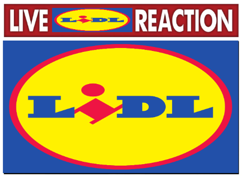
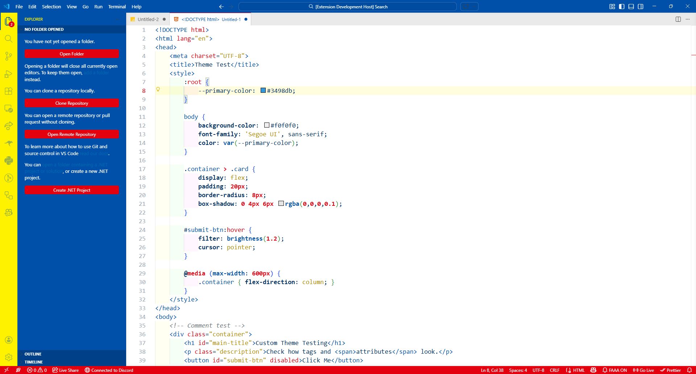
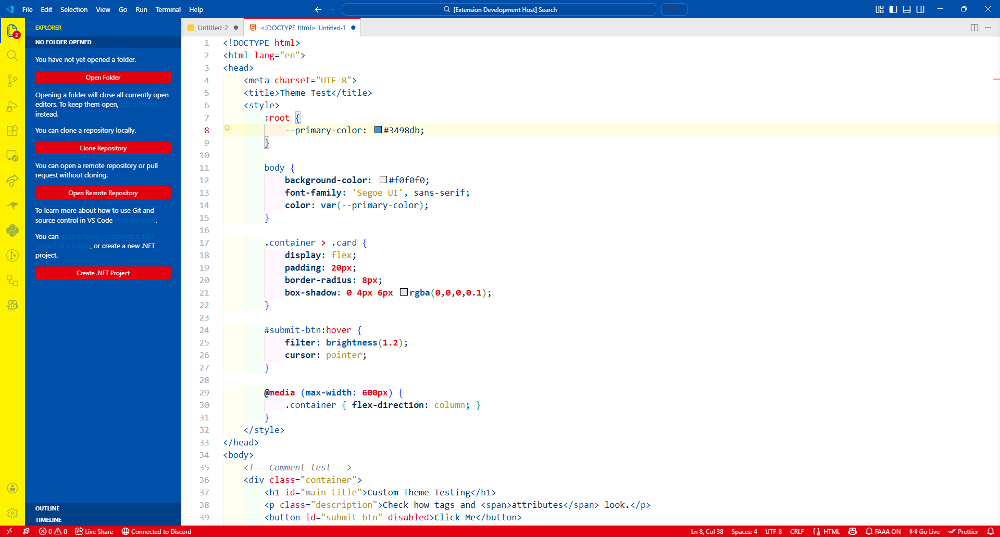
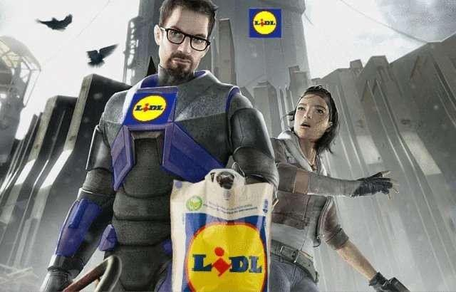

# LIDL Theme for VSCode

Why pay for premium IDE themes when you have **LIDL QUALITY** at literally 0 cost?
Boost your coding productivity by at least 400% with pure discount energy.

When using this Extension you will be granted a 10% Discount at your local [LIDL Store](https://lidl.com)

## The Variants

- **Lidl Light**: Flashbang your eyes with the raw power of the bakery section at 7 AM.

- **Lidl Dark**: For browsing the middle aisle at 3 AM looking for a cheap Kong Strong Energy Drink.

## THE TRUE EXPERIENCE (Lidl Man)

Want to share your VSCode instance with the One LidlMan?

1. Install the Background extension in Extensions Tab.
2. It should auto apply. Now Lidl Man can live in your VSCode until the end of Time.

